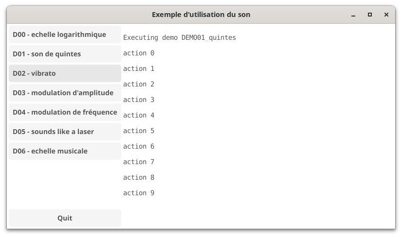

# appletgui - manage small demonstrative examples

**contact**: [Guillaume Boulant](mailto:gboulant@gmail.com?subject=dingo-applet)

The appletgui package provides a graphical user interface for the applet
package. It can be used to create a graphical application that contains
a set of demonstrative examples to play, each example being a standard go
function without argument and returning an error (see the applet package):

```go
func DEMO00_logscale() error {
    fmt.Println("Executing demo DEMO00_logscale")
    // Do something
    // ...
    return nil
}
```

Then, you can register this function as a demonstrative example, giving
it a name identifier and a short description. This can be done eather
with the applet package or the appletgui one (that contain a proxy to to
the NewExample applet function):

```go
import appgui "github.com/gboulant/dingo-appletgui"

appgui.NewExample("D00", "echelle logarithmique", DEMO00_logscale)
appgui.NewExample("D01", "son de quintes", DEMO01_quintes)
applet.NewExample("D02", "exemple 02", DEMO02_hello)
...
```

And finaly, the main function should execute the `StartExampleApp`:

```go
appgui.StartExampleApp("My Application")
```

This function starts a graphical user interface that let the user play
the different examples:


